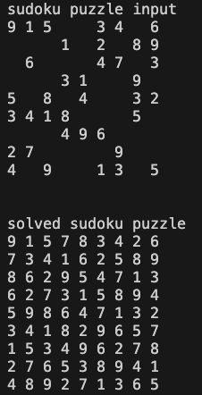

# Sudoku Solver (TypeScript)
a proper sudoku solver where the input has to be 9x9 and with a minimum of 17 clues

the goal of this project was to figure out how to implement a sudoku solver without using any resources (other than a gif of a backtracking algorithm going row by row on wikipedia). the challange of this project was for me to figure out how to implement the solver based of these minimal details, i already arrived at the conclusion a recursive approach of some kind would be needed.



# How To Run
## install dependencies
```
npm i
```

## how to run example 
```
npx tsc && node ./dist/index.js
```

## how to run tests
```
npm run test
```

# API Documentation 
## Function: solveProperSudoku()

> **solveProperSudoku**(`puzzleInput`): `number`[][]

Defined in: [sudokuSolver.ts:163](https://github.com/zoolu-got-rhythm/sudoku-solver-ts/blob/fd0143fe17b30e8b908cb645207283f7118a189f/src/sudokuSolver.ts#L163)

Solves a proper sudoku puzzle (9x9 with a minimum of 17 clues) with a recursive backtracking algorithm

### Parameters

#### puzzleInput

a 9x9 2d array (by row) or 1d array of numbers where -1 represents an empty cell

`number`[] | `number`[][]

### Returns

`number`[][]

a 9x9 2d array of numbers representing the solved sudoku puzzle
